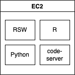

# RStudio Pulumi Recipes

Recipes for deploying RStudio infrastructure with Pulumi.

## Pulumi

### Getting started

All of the recipes require that you have Pulumi set up and running on your computer. If this is your first time using Pulumi we recommend that you follow along with the Pulumi getting started tutorial: <https://www.pulumi.com/docs/get-started/aws/begin/>.

### Install Pulumi

Install Pulumi:

```bash
brew install pulumi/tap/pulumi
```

### Configure Pulumi to access your AWS Account

#### Option 1

If you are using AWS SSO make sure you are logged in:

```bash
aws sso login
```

#### Option 2

If supported you can use an access key / secret key.

```bash
export AWS_ACCESS_KEY_ID=<YOUR_ACCESS_KEY_ID>
export AWS_SECRET_ACCESS_KEY=<YOUR_SECRET_ACCESS_KEY>
```

## Recipes

The recipes below have been tested and are confirmed to work. Additional recipes can be found in [recipes/wip/](./recipes/wip/). These recipes are still a work in progress.

### Rstudio Workbench

#### Single Server Workbench with code-server

**[recipes/rsw-single-server](recipes/rsw-single-server)**

A single server deployment of RStudio Workbench with code-server installed.

⚠️ This deployment uses a self signed cert. It will not open in Google Chrome. It will open in FireFox after you accept the security warnings.

<details>
<summary>Infrastructure diagram</summary>



</details>

#### High availability RStudio Workbench

**[recipes/rsw-ha](recipes/rsw-ha)**

A high availability deployment of RStudio Workbench with no launcher (e.g. R only).

<details>
<summary>Infrastructure diagram</summary>


</details>

### Rstudio Connect

#### Single Server RStudio Connect

**[recipes/rsc-single-server](recipes/rsc-single-server)**

A simple single server deployment of RStudio Connect that uses the built in user management.

<details>
<summary>Infrastructure diagram</summary>


</details>
