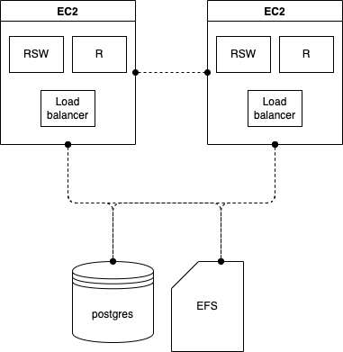
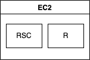

# RStudio Pulumi Recipes

Recipes for deploying RStudio infrastructure with Pulumi.

## Recipes

The recipes below have been tested and are confirmed to work. Additional recipes can be found in [recipes/wip/](./recipes/wip/). These recipes are still a work in progress.

### (1) High availability RStudio Workbench

**[recipes/rsw-ha](recipes/rsw-ha)**

A high availability deployment of RStudio Workbench with no launcher (e.g. R only).

Infrastructure diagram

### (2) Single Server RStudio Connect

**[recipes/rsc-single-server](recipes/rsc-single-server)**

A simple single server deployment of RStudio Connect that uses the built in user management.

Infrastructure diagram

