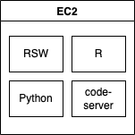

# RStudio Workbench High availability setup.



⚠️ This deployment uses a self signed cert. It will not open in Google Chrome. It will open in FireFox after you accept the security warnings.

## Usage

Before getting started please read the project [README](../../README.md) to ensure you have all of the required dependencies installed.

There are three primary files / directories:

- `__main__.py`: contains the python code that will stand up the AWS resources.
- `server-side-justfile`: contains the commands required to install RSW and the required dependencies. This file will be copied to each ec2 instance so that it can be executed on the server.

### Step 1: Create new virtual environment

```bash
python -m venv venv
source venv/bin/activate
python -m pip install --upgrade pip wheel
pip install -r requirements.txt
```

### Step 2: Pulumi configuration

Select your pulumi stack.

```bash
pulumi stack select dev
```

Create a new key pair to be used with AWS:

```
just new-key-pair
```

Set the following pulumi configuration values:

```bash
pulumi config set email <XXXX>
pulumi config set --secret rsw_license $RSW_LICENSE
cat key.pub | pulumi config set public_key
```

### Step 3: Spin up infra

Create all of the infrastructure.

```bash
pulumi up
```

### Step 3: Validate that RSW is working

Visit RSW in your browser (use FireFox instead of Chrome):

```
just open
```

Login and start some new sessions.

You can also ssh into the ec2 instances for any debugging.

```bash
just ssh
```
