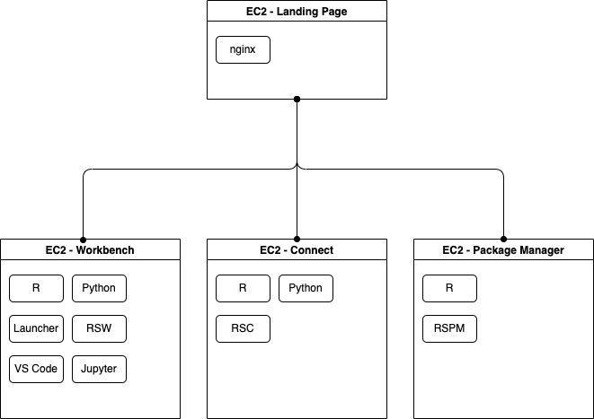

# RStudio Team with local launcher



## Usage

There are two primary files:

- `__main__.py`: contains the python code that will stand up the AWS resources.
- `templates/justfile`: contains the commands required to install RSW and the required dependencies. This file will be copied to each ec2 instance so that it can be executed on the server.

### Step 1: Create new virtual environment

```bash
python -m venv venv
source venv/bin/activate
python -m pip install --upgrade pip wheel
pip install -r requirements.txt
```

### Step 2: Spin up infra

Create all of the infrastructure.

```bash
export AWS_SSH_KEY_ID="XXXXXX"
export AWS_PRIVATE_KEY_PATH="~/.ssh/XXXX.pem"
pulumi up
```